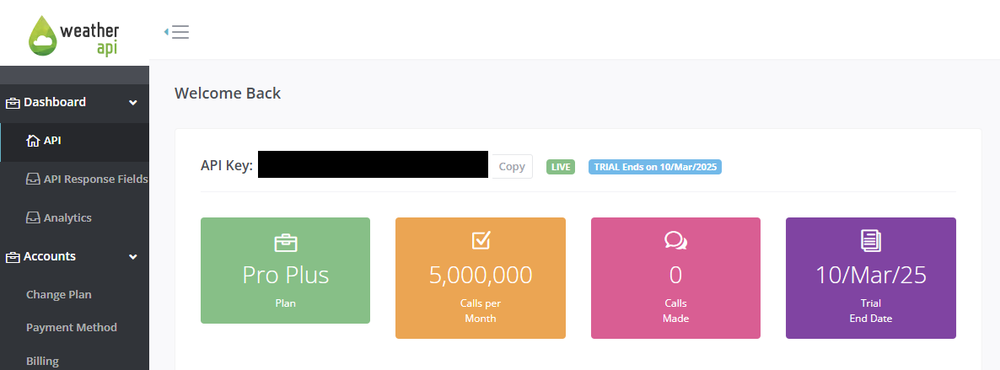
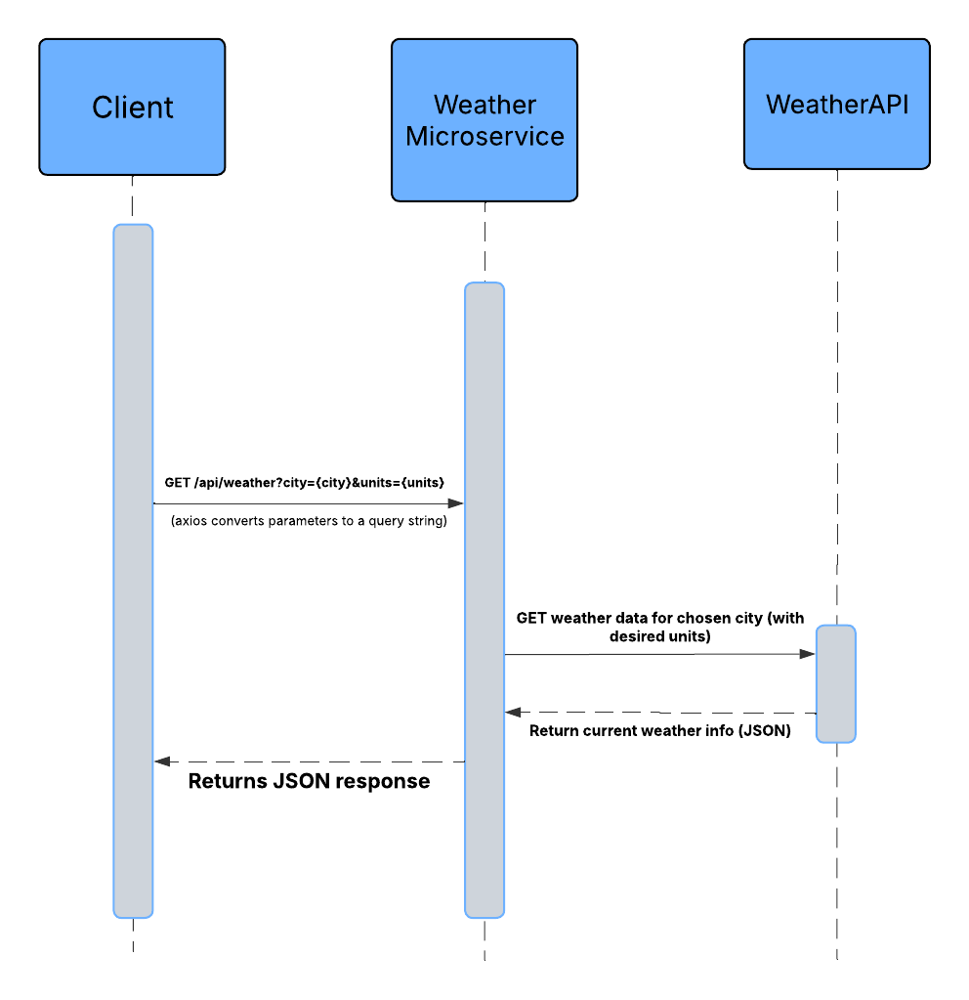

# Weather Microservice
This microservice provides current weather data by querying WeatherAPI.  
It returns JSON data containing temperature, precipitation, wind speed, humidity, and more.

## **Communication Contract**

This microservice follows a **REST API** architecture. Requests must be sent as standard **HTTP GET** calls, and the response is **JSON**. 

- **Base URL:** `http://localhost:<PORT>/api/weather`
- **Default Port:** `3000`
- **Response Format:** `JSON`

## **How to Programmatically REQUEST Data**

**Endpoint:** `GET /api/weather`

### **Required/Optional Parameters**

- **`city`** (required): The city name for which you want weather data.
- **`units`** (optional):  
  - `imperial` → Temperature in Fahrenheit, wind speed in mph, precipitation in inches  
  - `metric` (default) → Temperature in Celsius, wind speed in kph, precipitation in mm


**Example Python API Call:**
```py
import requests

url = "http://localhost:3000/api/weather"

params = {
    "city": "Corvallis",
    "units": "imperial"
}

response = requests.get(url, params=params)
print(response.json())

# if you want the JSON in a more readable format
# json_formatted = json.dumps(response.json(), indent = 4) 
# print(json_formatted)
```
**Example JavaScript API Call:**
```js
const axios = require('axios');
async function get_weather() {
    const response = await axios.get('http://localhost:3000/api/weather', {
        params: {
            city: 'Corvallis',
            units: 'imperial'
        }
    })
    console.log(response.data);
} 

get_weather();
```

## **How to Programmatically RECEIVE Data**

### JSON Response Fields

- **`city`**
  The name of the city.

- **`temperature`**
  The current temperature (Fahrenheit if `imperial`, Celsius if `metric`).

- **`units`** 
  Either `imperial` or `metric`.

- **`precipitation`**   
  Amount of precipitation (inches if `imperial`, mm if `metric`).

- **`windSpeed`** 
  Wind speed (mph if `imperial`, kph if `metric`).

- **`humidity`** 
  Humidity percentage (`0` – `100`).

- **`cloud`** 
  Cloud coverage percentage (`0` – `100`).

- **`description`**  
  A short description of current conditions (e.g., `'Light rain'`).

- **`updatedAt`**  
  Timestamp of the last update (e.g., `'2025-02-24 12:30'`).

### Example Response JSON

```json
{'city': 'Corvallis', 'temperature': 46, 'units': 'imperial', 'precipitation': 0, 'windSpeed': 2.9, 'humidity': 89, 'cloud': 0, 'description': 'Clear', 'updatedAt': '2025-02-25 20:30'}
```

### Example Response JSON (formatted)

```json
{
  city: 'Corvallis',
  temperature: 46,
  units: 'imperial',
  precipitation: 0,
  windSpeed: 2.9,
  humidity: 89,
  cloud: 0,
  description: 'Clear',
  updatedAt: '2025-02-25 20:30'
}
```

## **Environment Variables**

This microservice uses a `.env` file to hold the API key and port number.

1. Create a `.env` file in the root directory
2. Add the following:

   ```py
   WEATHER_API_KEY= # PUT YOUR API KEY HERE
   PORT=3000 # change the port number to whatever you want
   ```

This ensures that sensitive information like the API key are not hard-coded into your program.

If you don't want to bother with this step, you can also just add the key and port number inside the microservice file:
```js
const PORT = process.env.PORT || 'PUT KEY HERE';
const WEATHER_API_KEY = process.env.WEATHER_API_KEY || 3000;
```

## **WeatherAPI**
This microservice uses WeatherAPI, a free external API that provides realtime weather information.

In order to use it, you need to acquire an API key.

1. Go to WeatherAPI's website and sign up for an account. [Link to website](https://www.weatherapi.com/)
2. Once you create an account, an API key should automatically be provided under your account, visible on the dashboard. Simply copy the key and paste it in the ```.env``` file!



## **Running the Microservice (locally)**

Be sure to have node.js installed, then run this command to install the necessary packages:

```bash
npm install express axios dotenv
```

Then, start the microservice by running:

```bash
npm start
```

The console should display:

```
Weather microservice is running on port 3000.
```

## **Sequence Diagram**

